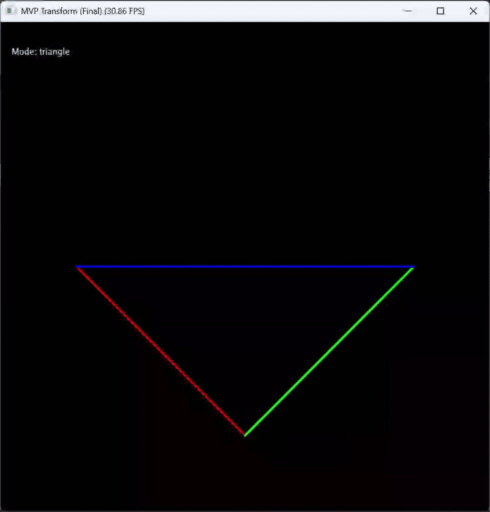
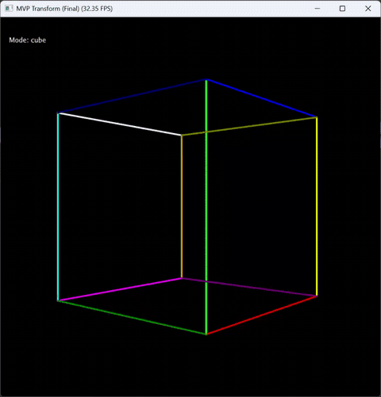

# MVP 变换与 3D 可视化（Taichi 实现）

## 项目简介

本项目基于 **Taichi 编程框架** 实现了经典的计算机图形学管线——**MVP（Model-View-Projection）变换**，将三维空间中的几何体映射到二维屏幕进行可视化。

项目包含两个核心部分：

- **二维三角形（绕 Z 轴旋转）**
- **三维立方体（绕 Y 轴旋转，透视效果）**

通过键盘交互，可以动态观察不同模型在透视投影下的变化过程。

---

## 实验目标

* 理解 3D 图形渲染中的 **MVP 变换流程**
* 独立实现：

  * 模型变换（Model）
  * 视图变换（View）
  * 投影变换（Projection）
* 掌握 Taichi 中的：

  * 并行计算（@ti.kernel）
  * 向量与矩阵操作

---

## 核心原理

### 1 MVP 变换流程

对于任意三维点：

$$ v_{clip} = M_{proj} \cdot M_{view} \cdot M_{model} \cdot v $$

然后进行：

- **透视除法（Perspective Divide）**
$$ v_{ndc} = \frac{v_{clip}}{w} $$

- **视口变换（Viewport Transform）**
  将坐标映射到 GUI 的 ([0,1]) 空间

---

### 2 三类变换矩阵

#### Model（模型变换）

* 三角形：绕 **Z 轴旋转**
* 立方体：绕 **Y 轴旋转**

---

#### View（视图变换）

将相机移动到原点：

```python
[1 0 0 0]
[0 1 0 0]
[0 0 1 -5]
[0 0 0 1]
```

---

#### Projection（投影变换）

分两步实现：

1. 透视 → 正交（压缩视锥体）
2. 正交投影 → 标准立方体

---

## 选做内容：3D 立方体

在基础三角形上扩展：

* 定义 **8 个顶点**
* 构建 **12 条边**
* 实现透视旋转

最终效果：
一个具有空间深度的线框立方体

---

## 交互方式

| 按键    | 功能     |
| ----- | ------ |
| `A`   | 逆时针旋转  |
| `D`   | 顺时针旋转  |
| `T`   | 切换到三角形 |
| `C`   | 切换到立方体 |
| `ESC` | 退出     |

---

## 运行方式

### 1 安装依赖

```bash
pip install taichi
```

### 2 运行程序

```bash
python main.py
```

---

## 项目结构

```bash
.
├── main.py        # 主程序（MVP实现 + 渲染）
├── README.md      # 项目说明
└── assets/        # 演示GIF
```

---

## 项目特点

* ✅ 完整实现 MVP 渲染流程
* ✅ 全部使用 Taichi kernel（GPU/并行友好）
* ✅ 三角形 + 立方体双模式
* ✅ 每条边独立颜色（增强可视化）
* ✅ 实时交互旋转

---

## 效果展示

三角形：



正方体：



---

## 实验总结

通过本实验，可以清晰理解：

* 3D → 2D 的完整数学流程
* 透视投影如何产生“远小近大”的效果
* 不同坐标空间之间的转换关系

同时，Taichi 的数据并行模型使得矩阵运算更加直观高效。

